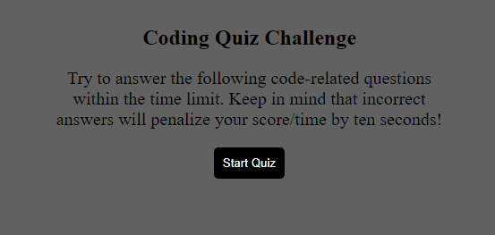
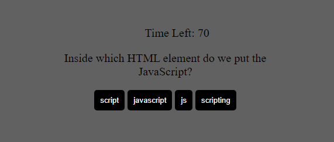
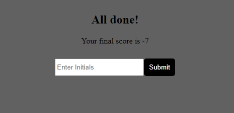

# Code Quiz

## Key Features

➕ when you click the start button, then a timer starts and you are presented with a question

➕ when you answer a question, then you are presented with another question

➕ when you answer a question incorrectly, then time is subtracted from the clock

➕ when all questions are answered or the timer reaches 0, then the game is over

➕ when the game is over, then you can save your initials and your score

### Link to deployed site 
https://michaeldigi.github.io/Code-Quiz/

